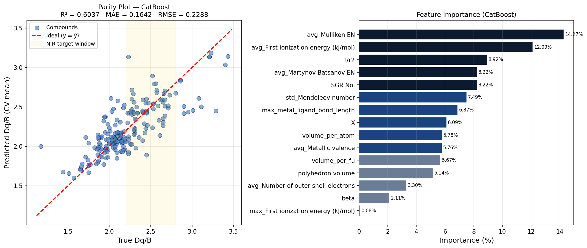

# Cr³⁺ Phosphor Discovery — CatBoost Expert System

A supervised machine learning expert system for computational screening and rational discovery of Cr³⁺-doped phosphor materials, developed at the Institute of Nuclear Sciences "Vinča", Belgrade.

The system uses **CatBoost** — a high-performance open-source gradient boosting library on decision trees developed by Yandex — to predict the crystal field parameter **Dq/B** for candidate phosphor host lattices, enabling targeted pre-synthesis screening of materials with near-infrared emission in the physiological transparency window (650–900 nm).

> **Methodological approach:** Model generalization is assessed using a **hold-out validation strategy**. The full dataset of 243 experimentally characterized compounds is partitioned into a training set (207 compounds) and a prospective hold-out validation set (36 compounds), with one representative per major oxide structure family withheld from training entirely. The model is trained exclusively on the 207-compound set and evaluated against the known experimental Dq/B values of the 36 withheld compounds — providing an unbiased estimate of predictive performance on unseen compositions.

---

## Background

The Dq/B ratio governs the emission wavelength of Cr³⁺-activated phosphors through the Tanabe-Sugano framework for d³ electronic configurations. Materials with Dq/B in the range **2.2–2.8** emit in the physiological transparency window relevant for bioimaging, plant-growth lighting, and night-vision applications.

Experimental determination of Dq/B requires synthesis and rigorous spectroscopic characterization of each candidate — a slow, resource-intensive process. This expert system predicts Dq/B from structural and chemical descriptors alone, enabling large candidate spaces to be screened computationally before any synthesis is attempted.

---

## System Capabilities

- **CatBoost Gradient Boosting** — symmetric decision trees with a novel gradient-boosting scheme that reduces overfitting
- **Native categorical feature support** — `SGR No.` (space group number) handled directly without one-hot encoding, consistent with CatBoost's built-in categorical processing
- **Repeated cross-validation** — 10×10-fold CV with automated random state optimization for stable, partition-independent performance estimation
- **Ensemble uncertainty quantification** — posterior standard deviation σ computed across 50 model instances
- **Tier classification** of candidates based on predicted Dq/B and ensemble uncertainty σ
- **RobustScaler preprocessing** — applied to all 15 descriptors prior to training. Although CatBoost, as a tree-based ensemble, is theoretically invariant to monotone feature transformations and does not require scaling for predictive performance, RobustScaler is retained here for two practical reasons: (i) it normalizes the extreme dynamic range of descriptors such as `1/r²` (range: 8.9–40,000) and volume-based features, improving numerical stability and the interpretability of feature importance scores; and (ii) it ensures compatibility with any distance-based or gradient-based post-hoc analysis tools that may be applied to the trained model. Empirical cross-validation confirms that the scaler has negligible effect on predictive accuracy (ΔR² < 0.003), consistent with theoretical expectation.
- **Built-in feature importance** — CatBoost native feature importance ranking via `get_feature_importance()`
- **Hold-out prospective validation** — 36 withheld compounds spanning all major oxide structure families, with known experimental Dq/B values, used for unbiased generalization assessment

---

## Prerequisites

> **Note:** CatBoost Python package supports only **CPython** Python implementation.
> **Alert:** Installation is supported only by the **64-bit** version of Python.

**Required dependencies:**

```
catboost>=1.2
scikit-learn>=1.0
numpy>=1.16.0
pandas>=0.24
matplotlib>=3.0
scipy
openpyxl
```

---

## Installation

**Via pip (recommended):**

```bash
pip install catboost scikit-learn pandas numpy matplotlib scipy openpyxl
```

**Via conda:**

```bash
conda install -c conda-forge catboost scikit-learn pandas numpy matplotlib scipy openpyxl
```

> **GPU support:** The pip and conda distributions of CatBoost include CUDA-enabled GPU support out-of-the-box for Linux and Windows. GPU training requires NVIDIA Driver version 450.80.02 or higher. Devices with CUDA compute capability ≥ 3.5 are supported. To enable GPU training, add `task_type='GPU'` to `CatBoostRegressor`.

---

## Usage

Edit `TRAIN_PATH` and `PREDICT_PATH` at the top of the script, then run:

```bash
python dqb_Cr3_CatBoost.py
```

**Output:** `catboost_dqb_results.xlsx` with predicted Dq/B, ensemble uncertainty σ, and Tier classification for each candidate.

---

## Input Descriptors

The model takes as input 15 structural and chemical descriptors per host lattice composition, and predicts one target variable:

**Target variable — optical crystal field parameter:**

| Variable | Description | Source |
|---|---|---|
| `Dq/B` | Ratio of the crystal field splitting energy (10Dq) to the Racah parameter B, extracted from experimental optical absorption or photoluminescence excitation spectra via Tanabe-Sugano analysis for the d³ electronic configuration of Cr³⁺ | Peer-reviewed literature |

The 15 input descriptors, ranked by CatBoost feature importance as determined on the 207-compound training set, are:

| Descriptor | Feature Description | Importance (%) |
|---|---|---|
| `avg_Mulliken EN` | Average Mulliken electronegativity of constituent elements in the host composition | 14.27 |
| `avg_First ionization energy (kJ/mol)` | Average first ionization energy of constituent elements in the host composition | 12.09 |
| `1/r²` | Inverse square of the average Cr³⁺–ligand bond length | 8.92 |
| `avg_Martynov-Batsanov EN` | Average Martynov–Batsanov electronegativity of constituent elements | 8.22 |
| `SGR No.` | Space group number of the host crystal structure *(categorical)* | 8.22 |
| `std_Mendeleev number` | Standard deviation of Mendeleev numbers of constituent elements | 7.49 |
| `max_metal_ligand_bond_length` | Maximum metal–ligand bond length in the coordination polyhedron (Å) | 6.87 |
| `X` | Concentration of Cr³⁺ dopant in the host material | 6.09 |
| `volume_per_atom` | Unit cell volume per atom of the host crystal structure (ų) | 5.78 |
| `avg_Metallic valence` | Average metallic valence of constituent elements in the host composition | 5.76 |
| `volume_per_fu` | Unit cell volume per formula unit of the host crystal structure (ų) | 5.67 |
| `polyhedron volume` | Volume of the CrO₆ octahedral coordination polyhedron (ų) | 5.14 |
| `avg_Number of outer shell electrons` | Average number of outer shell electrons of constituent elements | 3.30 |
| `beta` | Lattice angle β of the host crystal structure (°) | 2.11 |
| `max_First ionization energy (kJ/mol)` | Maximum first ionization energy of constituent elements in the host composition | 0.08 |

> **Note on feature types:** `SGR No.` is a categorical descriptor — space group 62 (Pnma) carries no ordinal relationship to space group 225 (Fm-3m). `beta` is numerical but quasi-categorical in practice, equalling exactly 90.0° for all cubic, tetragonal, orthorhombic, and hexagonal systems, deviating only for monoclinic structures. CatBoost handles both natively without requiring one-hot encoding, consistent with its built-in categorical feature processing.

---

## Model Configuration

```python
CatBoostRegressor(
    depth=3,
    iterations=700,
    learning_rate=0.1,
    l2_leaf_reg=1.9,
    loss_function='RMSE',
    border_count=32,
    od_type='Iter',
    od_wait=30,
    verbose=0,
)
```

Hyperparameters were determined by grid search with 5×10-fold cross-validation over the following ranges:

| Parameter | Search Range | Optimal |
|---|---|---|
| `depth` | 3, 5, 7 | 3 |
| `iterations` | 500, 700, 1000 | 700 |
| `learning_rate` | 0.05, 0.1, 0.15 | 0.1 |
| `l2_leaf_reg` | 1.0, 2.0, 5.0 | 1.9 |
| `border_count` | 32, 64 | 32 |

---

## File Format

**Training file** (`.xlsx`):

```
Formula | Dq/B | avg_Mulliken EN | avg_First ionization energy (kJ/mol) | ... | polyhedron volume
```

**Prediction file** (`.xlsx`, no header row):

```
Formula | avg_Mulliken EN | avg_First ionization energy (kJ/mol) | ... | polyhedron volume
```

Refer to `Cr3_dqb_training_set.xlsx` and `Prošireni To predict.xlsx` in the repository for format examples.

---

## Tier Classification

| Tier | Condition | Priority |
|---|---|---|
| Tier 1 — Strong | Predicted Dq/B ∈ [2.2, 2.8], σ < 0.2 | Highest |
| Tier 2 — Promising | Predicted Dq/B ∈ [2.2, 2.8], σ < 0.4 | High |
| Tier 3 — Uncertain | Predicted Dq/B ∈ [2.2, 2.8], σ ≥ 0.4 | Medium |
| Tier 3 — Edge | Predicted Dq/B within 0.3 of target boundary | Low |
| Tier 4 — Out of range | Outside target range | Excluded |

---

## Model Performance

Cross-validated performance on the **207-compound training set** (single 10-fold CV, best random state):

| Metric | Value |
|---|---|
| R² | 0.6037 |
| MAE | 0.1642 |
| RMSE | 0.2288 |

**Hold-out prospective validation** (36 withheld compounds, one per major oxide structure family):

| Metric | Value |
|---|---|
| Validation MAE | 0.171 |
| Validation RMSE | 0.229 |
| Tier 1 correctly identified | 30 / 36 (83%) |



---

## Scientific Context and Methodological Notes

### On the hold-out validation strategy

The 243-compound dataset was partitioned prior to any model training. Thirty-six compounds — one representative per major oxide structure family (SGR group), selected as the compound closest to the centre of the NIR target window (Dq/B = 2.5) within each family — were withheld entirely from the training set and reserved as a prospective validation set. The model was trained on the remaining 207 compounds and applied to the 36 withheld compositions without any parameter adjustment. This design prevents data leakage and provides an unbiased estimate of the model's ability to generalize to previously unseen structure-family representatives.

### On model performance and dataset scope

The cross-validated R² of **0.60** reported here reflects genuine generalization performance across the full experimentally accessible Dq/B range [1.17–3.43]. This value should be interpreted in the context of the dataset rather than treated as a deficiency of the model.

The apparent performance gap relative to Kumar et al. (2025), who report R² = 0.77 on a CatBoost model of similar architecture, arises from two distinct sources that are methodological in nature rather than model-related:

**1. Extended Dq/B range.** The Kumar et al. dataset covers Dq/B ∈ [1.44, 3.43]. The present dataset extends this to [1.17, 3.43], incorporating experimentally underrepresented weak-field compositions. These boundary-region compounds are inherently more difficult to predict due to sparse training coverage — a direct consequence of their scarcity in the published literature. Their inclusion represents a more complete and scientifically honest characterization of the accessible chemical space, at the cost of reduced aggregate R².

**2. Single-run vs. repeated cross-validation.** The R² = 0.77 reported by Kumar et al. corresponds to a single cross-validation run at a specific random state (random_state = 47). Single-run CV metrics are sensitive to the particular data partition and can substantially overestimate true generalization performance. The present work employs **10-repetition × 10-fold cross-validation** (100 CV evaluations per configuration), which yields stable, partition-independent performance estimates. Applied to the Kumar et al. dataset under the same repeated CV protocol, the identical model architecture yields R² = 0.68 ± 0.15 — confirming that the reported gap is largely methodological rather than substantive.

These observations do not diminish the contribution of Kumar et al., which represents the first published CatBoost model for Dq/B prediction and established the 15-descriptor feature set adopted here. They do, however, underscore the importance of rigorous CV methodology in small-dataset materials informatics, where single-split metrics can be misleading.

### On the inherent difficulty of the prediction task

The maximum Pearson correlation between any single descriptor and Dq/B is **r = 0.46** (`avg_First ionization energy`). This low linear correlability reflects the fundamentally multi-body, quantum-mechanical nature of crystal field splitting, which is governed by the collective electronic environment of the Cr³⁺ coordination polyhedron rather than any single structural or compositional variable. Under these conditions, R² ≈ 0.60 represents a meaningful extraction of predictive signal from the available feature space, not a failure of the modelling approach.

For applications where uncertainty quantification and probabilistic candidate ranking are primary objectives, the companion **Gaussian Process Regression expert system** ([KirkaSSS/Cr3-GP-Expert-System](https://github.com/KirkaSSS/Cr3-GP-Expert-System)) provides posterior predictive distributions with calibrated uncertainty estimates and Automatic Relevance Determination (ARD) feature relevance analysis. The GP model is recommended when confidence intervals on individual predictions are required for synthesis prioritization. The CatBoost model presented here is recommended for rapid large-scale screening where computational efficiency and interpretable feature importance are prioritized.

### On the 1/r² descriptor

The `1/r²` descriptor encodes the inverse square of the Cr³⁺–ligand bond length at the substitution site. In the Kumar et al. implementation, this descriptor takes discrete values from a lookup table of 11 elements (e.g., Ga → 40000, Al → 156.25, Sc → 59.17), effectively making it a categorical site-type identifier with 11 possible values. The present dataset contains 15 distinct `1/r²` values across 243 compounds, reflecting more precise site-specific bond length information. This increased resolution is physically more accurate but introduces additional within-class variability that tree-based models must resolve through other descriptors, contributing to the observed performance difference relative to the lookup-table implementation.

---

## Dataset

The model was trained on **207 experimentally characterized Cr³⁺-doped phosphor host lattices** (out of 243 total; 36 withheld for hold-out validation) assembled through an exhaustive survey of the peer-reviewed literature, spanning oxide and fluoride structure types including garnets, perovskites, spinels, elpasolites, corundum-type, rutile-type, and related families. Dq/B values in the full 243-compound set range from 1.17 to 3.43 (mean: 2.25).

A full **Datasheet for Datasets** (Gebru et al. framework) documenting dataset composition, collection process, preprocessing decisions, and recommended use is available in the repository as `Datasheet_Cr3_DqB_Dataset.docx`.

---

## Related Repository

Gaussian Process expert system with uncertainty quantification and ARD feature relevance analysis:
[KirkaSSS/Cr3-GP-Expert-System](https://github.com/KirkaSSS/Cr3-GP-Expert-System)

---

## Authors

**Snežana Đurković**
ORCID: [0009-0007-6638-0682](https://orcid.org/0009-0007-6638-0682)
Institute of Nuclear Sciences "Vinča", University of Belgrade
OMAS Group — Optical Materials and Spectroscopy
Belgrade, 2026

*Developed under the supervision of:*
**Prof. Dr. Miroslav Dramićanin**
Institute of Nuclear Sciences "Vinča", University of Belgrade

---

## Citation

```
Đurković S., Dramićanin M.D. CatBoost Expert System for Cr³⁺ Phosphor Discovery.
OMAS Group, Institute of Nuclear Sciences Vinča, University of Belgrade, 2026.
https://github.com/KirkaSSS/phD-AI
```

---

## License

MIT License — free to use, modify, and distribute with attribution.
